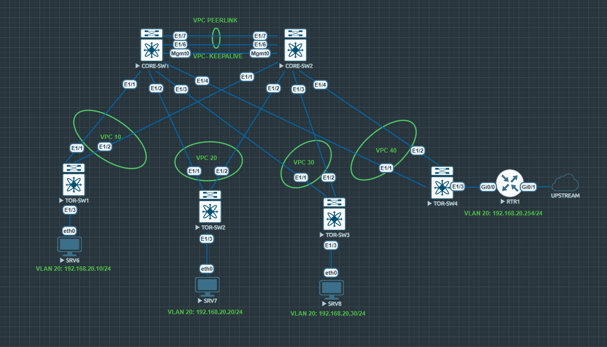

# 🧠 Null0 Labs VPC Lab Configurations
Welcome to the official repository for the **Null0 Labs VPC Lab**—a virtual lab environment designed to teach and test cisco VPC concepts. This repo includes configuration files, topology diagrams, and a full video walkthrough to help you replicate or extend the lab.

## 📺 Video Walkthrough

Dive into the full lab setup and explanation on YouTube:  
👉 [Watch the walkthrough](https://youtu.be/8p9Fballx9M?si=LzpzqZAN6gIaxM6A)

## 🗺️ Lab Topology

Here's the visual layout of the VPC lab.  
📌 _Click to expand the image for full resolution._

